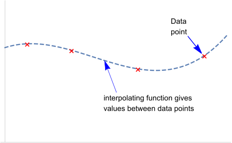
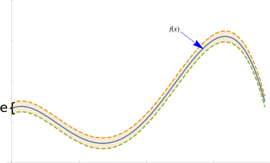

# Interpolation

Interpolation can be used to solve two types of problems.  In the first we are given a discrete set of data points (perhaps from an experiment or other measurement) and we want to know what would result if a measurement was done at some intermediate point.  This is illustrated below:  

  

The assumption here is that there exists some reasonably well-behaved underlying function that our measurements are effectively evaluating at the discrete set of points.  The need for interpolation is so fundamental that solutions to this problem date to antiquity and it is thought it was routinely done by the ancient Greeks and Persians.  It was described in the early Chinese mathematical text [*The Nine Chapters on the Mathematical Art*](https://en.wikipedia.org/wiki/The_Nine_Chapters_on_the_Mathematical_Art) and in the [*Almagest*](https://en.wikipedia.org/wiki/Almagest) by [Ptolemy](https://en.wikipedia.org/wiki/Ptolemy) in the 2nd century AD.

There is, however, a second problem where we may know the underlying function quite well and be able to evaluate it relatively easily at any point.  However, even in that case it may be useful to replace this function with an interpolating function.  One example where this is often done is when we have a function $f(x)$ that we know analytically but that does not have an analytic form for its antiderivative.  If we can replace this function, say by its [Taylor](https://en.wikipedia.org/wiki/Taylor_series) series about a suitable point, then it is fairly straightforward to analytically integrate the Taylor series (as it is a polynomial).  This process is call analytic substitution.  In order for this to be useful, the interpolating function needs to be "close" to the original $f(x)$ as illustrated below:  

  

by "close" we mean that our interpolating function stays with a tube of diameter $\epsilon$ of our original function $f(x)$.
In both cases, we are effectively replacing our underlying function with what is usually a weighted sum of a set of basis functions and we want this new function to be close to the original.

In interpolation we assume that either the data points we are given have no, or negligible, (measurement) errors or that we can generate such points by evaluating the underlying function exactly at such a discrete set of points.  As a result, we insure that our interpolating function at least agrees exactly with our underlying function at the given discrete set of points.  In curve fitting we generally assume that there are some errors in our data points and as a result we can relax the constraint that we get exact agreement with these data points usually in favor of getting a "fitted function" that is motivated by a model of the situation in question or is fairly straightforward to interpret and/or evaluate.
We will first examine interpolation.

The first question to ask is: What set of basis functions should we use?  Here we will use polynomials although other functions such as trigonometric functions are also common (Fourier Transform).  The fact that every continuous function on a closed interval $[a,b]$ can be approximated by a polynomial function (within a tube of diameter $\epsilon$ as in the figure above) was not actually proven until 1885 when the result was established by [Karl Weierstrass](https://en.wikipedia.org/wiki/Karl_Weierstrass).  We can frame this as the polynomial interpolation problem.

## Polynomial Interpolation Problem

Given data values $(x_0,f(x_0)), (x_1,f(x_1)), (x_2,f(x_2)),..., (x_n,f(x_n))$ find a polynomial $p(x)$ of appropriate degrees ($\leq n$), such that

$$ p(x_i)=f(x_i), \qquad\qquad i=0,1,2,...,n.$$

There are a couple of practical things to note:  

- there are actually $n+1$ data points here,
- we are numbering the points from $0$ to $n$.  While this is probably the most common numbering scheme, not all texts and software libraries use the same scheme (some may have $n-1$ points numbered from $1$ to $n$, or $n$ points numbered $0$ to $n-1$, or some other variant).  While it is straightforward to convert between these different schemes, it is imperative that you know which is being used or you will likely make an error when using or computing the interpolation.

